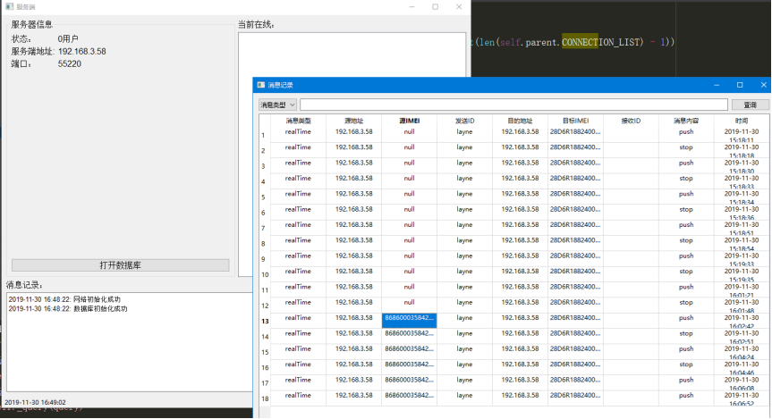

### 需求接口

+ 注册接口（可通过手机号或者邮箱号注册）（手机号要能收到验证码）

>  {'type': 'register', 'resourceIMEI': 'IMEI_1','data': 'login 123456'}

 


``` properties

AccessKey ID：LTAIwpkHW3fvAHfE
Access Key Secret	:TdXxg2kEfOTNvibMuGHGPV0V1mQVKM
短信模板:SMS_154390429
签名 : 成志智能


```


+ 登录接口（可通过手机号或者邮箱号登录）可以重置密码

>  {'type': 'login', 'resourceIMEI': 'IMEI_1','data': 'login 123456'}

 

+ 文件接口(resourceIMEI是手机自身的设备号, targetIMEI是目标转发的设备号，可以一对多，data是传输的文字)

>  {'type': 'file','resourceIMEI': 'IMEI_1','targetIMEI': 'IMEI_1','username': 'loginer','data': code}

 

下载接口(resourceIMEI是手机自身的设备号, targetIMEI是目标转发的设备号，可以一对多，data是要下载的文件)


{'type': 'file','resourceIMEI': 'IMEI_1','targetIMEI': 'IMEI_1','username': 'loginer','data': code}

 

+ 文字发送接口(resourceIMEI是手机自身的设备号, targetIMEI是目标转发的设备号，可以一对多，data是要发送的文字)

>  {'type': 'text','resourceIMEI': 'IMEI_1','targetIMEI': 'IMEI_1','username': 'loginer','data': code}

 

+ 实时广播接口(resourceIMEI是手机自身的设备号, targetIMEI是目标转发的设备号，可以一对多，data是要发送的指令)

> {'type': 'realTime','resourceIMEI': 'IMEI_1','targetIMEI': 'IMEI_1','username': 'loginer','data': code}

 

+ 返回值:要把使用的方法名返回

>  {'type': '方法名', 'result': '0', 'message': 'format error', 'reason': '{}'.format(e)}

+ 手机更新接口：

>  {
>
> ​    "id": 89,
>
> ​    "version": "48",
>
> ​    "versionName": "1.1.18",
>
> ​    "apkUrl": "d8c659f1ad674270a33d80fa425c2f6a.apk",
>
> ​    "apkName": "清远环境执法-v1.1.17.apk",
>
> ​    "isForce": true,
>
> ​    "updateInfo": "\n1. 修改服务器IP地址。\n\n更新时间：2019-11-25 18:00"
>
>   }


 





