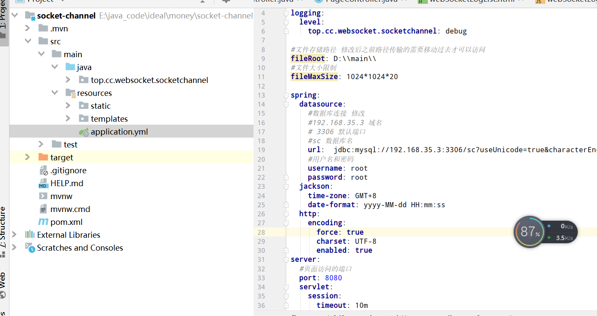
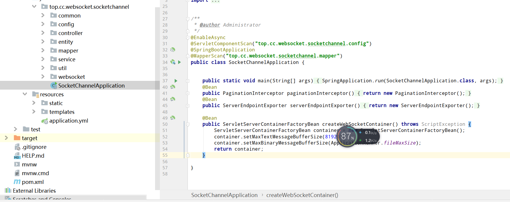

### 项目启动

#### 项目介绍

项目基于 Java8+ spring boot 2  + MySQL 5.7+ 


> 因此需要提前准备好Java 环境 MySQL 数据库环境 , 如何搭建环境百度很多 数据库可以暂时借用我的阿里云数据库 , 也可以自建


搭建好环境后

``` she'l'l
#Java版本号能出现
java -version 

#MySQL 能够连接
```


修改配置文件中的数据库连接信息, 建议先备份一份后修改




修改完成之后可以启动类




如果信息一样 可以帮你打包 服务器上运行

``` shell
nohup java -jar xxx.jar &


```


然后尝试浏览器访问

> 主机加端口 会跳转登录 没有则检测是否成功或者是否开启防火墙端口
>
> 示例:127.0.0.1:8080/


